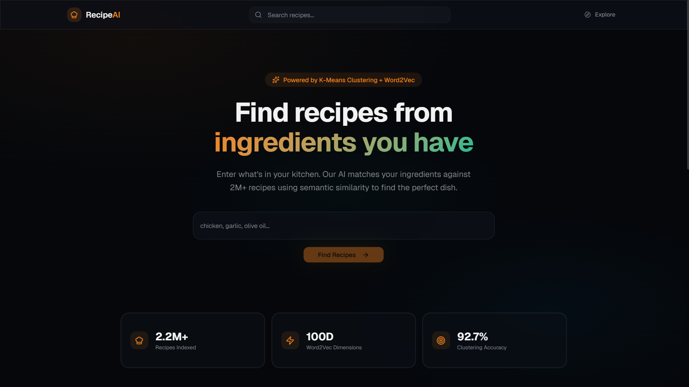

# 🍽️ Recipe Recommendation System

A production-ready, full-stack recipe recommendation engine powered by Machine Learning. 

This application uses Natural Language Processing (NLP) and K-Means clustering to analyze ingredients, organize over 2 million recipes, and provide lightning-fast, highly accurate recipe recommendations based on what you have in your pantry.



## ✨ Features

- **Ingredient-Based Search:** Input the ingredients you have, and the NLP engine will find the best matching recipes using Word2Vec embedding and Cosine Similarity.
- **Smart Clustering:** Recipes are categorized into clusters (e.g., Baked Goods, Savory, Sweet) using K-Means, making it easy to explore similar types of dishes.
- **Similar Recipe Discovery:** Every recipe detail page suggests highly similar recipes.
- **Modern UI/UX:** A stunning, responsive frontend built with React, Vite, and Shadcn UI, featuring glassmorphism, radial gradient animations, and a sleek dark mode interface.
- **Optimized Data Pipeline:** The massive 2.1GB raw CSV dataset is compressed into a lightweight SQLite database and a float16 numpy search index to ensure fast inference even on cloud free-tiers.

## 🛠️ Tech Stack

**Backend:**
- **Python 3.12**
- **FastAPI** (High-performance API framework)
- **Scikit-learn (v1.6.1)** (K-Means, PCA)
- **Gensim** (Word2Vec Embeddings)
- **SQLite3** (Lightweight database)

**Frontend:**
- **React 19**
- **Vite** (Build tool)
- **TypeScript**
- **Tailwind CSS v4**
- **Shadcn UI** (Component primitives)
- **React Query** (Data fetching and caching)

---

## 🚀 Quick Start Guide

### Prerequisites
Before you begin, ensure you have the following installed:
- [Docker Desktop](https://www.docker.com/products/docker-desktop/) (Highly Recommended)
- OR **Python 3.12** and **Node.js 20+** if running manually.

### 1. Data Preparation (Mandatory First Step)
Because the dataset is extremely large, you must run the data preparation script *once* before starting the servers. This script parses the raw 2.1GB `recipes_ui.csv` file, populates an indexed SQLite database, and creates a compressed Numpy array for fast memory loading.

```bash
# From the project root, create a virtual environment
python -m venv venv

# Activate the virtual environment (Windows)
.\venv\Scripts\activate

# Install the backend requirements
pip install -r backend/requirements.txt

# Download the spaCy english model
python -m spacy download en_core_web_sm

# Run the preparation script (This will take a few minutes)
python backend/scripts/prepare_data.py
```
*Note: If you run into build errors during `pip install`, ensure you are using Python 3.12 (not 3.13 or 3.14) to avoid missing pre-built wheels for ML libraries.*

---

### 2. Running the Application

#### Option A: Using Docker (Recommended)
The easiest way to run the full stack is using Docker Compose. It automatically manages the environments and dependencies.

```bash
docker-compose up --build
```
- **Frontend App:** http://localhost:5173
- **Backend API Docs (Swagger):** http://localhost:8000/docs

#### Option B: Running Manually
If you prefer not to use Docker, you can run the backend and frontend separately.

**Start the Backend:**
```bash
# In terminal 1
cd backend
..\venv\Scripts\activate
uvicorn app.main:app --reload --port 8000
```

**Start the Frontend:**
```bash
# In terminal 2
cd frontend
npm install
npm run dev
```

---

## 📚 API Reference

The backend exposes a fully documented REST API. You can view the interactive Swagger UI by navigating to `http://localhost:8000/docs`.

### Core Endpoints

- `GET /api/health` 
  Check if the server is running and the ML engine has successfully loaded the models into memory.

- `POST /api/recommend`
  **Body:** `{ "ingredients": ["chicken", "garlic", "soy sauce"], "top_n": 20 }`
  **Response:** Returns a list of the top `N` recommended recipes based on cosine similarity of the ingredient vectors.

- `GET /api/recipe/{recipe_id}`
  Fetches the complete details for a specific recipe, along with a list of 6 "similar" recommended recipes.

- `GET /api/explore?cluster=0&page=1&limit=20`
  Browse recipes paginated by their K-Means cluster assignment.

- `GET /api/search?q=cake&limit=20`
  Standard text-based search querying recipe titles.

- `GET /api/featured`
  Returns random featured recipes and total statistics for all clusters.

---

## 📂 Project Structure

```text
recipe_model_v2/
├── backend/
│   ├── app/
│   │   ├── main.py          # FastAPI application entry point
│   │   ├── engine.py        # ML Inference Engine (loads Joblib/Numpy models)
│   │   ├── routes.py        # API endpoints
│   │   └── database.py      # SQLite database interactions
│   ├── scripts/
│   │   └── prepare_data.py  # Data extraction and compression script
│   ├── requirements.txt     # Python dependencies
│   └── Dockerfile           # Production Python container
├── frontend/
│   ├── src/                 # React source code (Pages, Components, API hooks)
│   ├── public/              # Static assets
│   ├── index.html           # HTML entry point
│   ├── package.json         # Node.js dependencies
│   ├── vite.config.ts       # Vite configuration
│   └── Dockerfile.dev       # Frontend dev container
├── recipe_model/            # Contains ML artifacts (joblib, npy, db)
├── docker-compose.yml       # Local orchestration
└── README.md                # You are here
```

## 📝 Design Philosophy
The UI was meticulously crafted with an **Avant-Garde, Intentional Minimalism** approach. It rejects standard bootstrapped layouts in favor of a bespoke, immersive experience utilizing a deep dark mode, vivid saffron accents, and fluid glassmorphism to make finding recipes as satisfying as cooking them.
